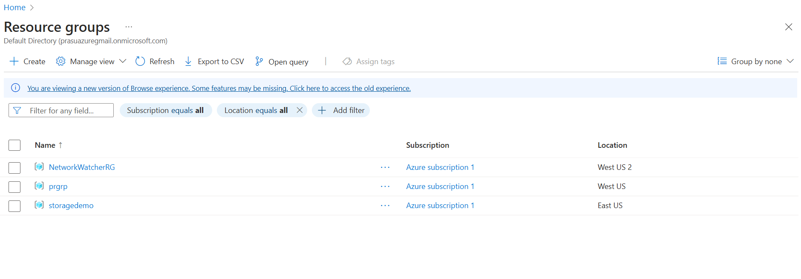
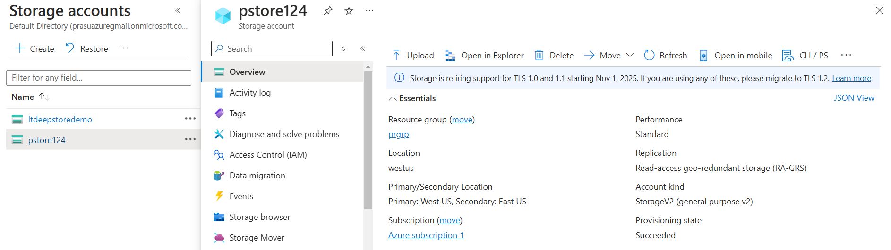

## Azure Storage Account CLI

### Install Azure CLI
For Azure CLI reference, refer [here](https://learn.microsoft.com/en-us/cli/azure/install-azure-cli).

### Login into Azure
```bash
az login
```

### create a resource group
```bash
 az group create -n prgrp -l westus
```


### create a storage container
```bash

az storage account create \
    --resource-group prgrp \
    --name pstore124 \
    --location westus \
    --allow-blob-public-access \
    --sku Standard_RAGRS
```


### create a container inside a storage account
```bash
az storage container create \
    --name mypstorecon123 \
    --account-name "pstore124" \
    --public-access "blob" \
    --resource-group prgrp
```
- Upload a Blob
```bash

```
