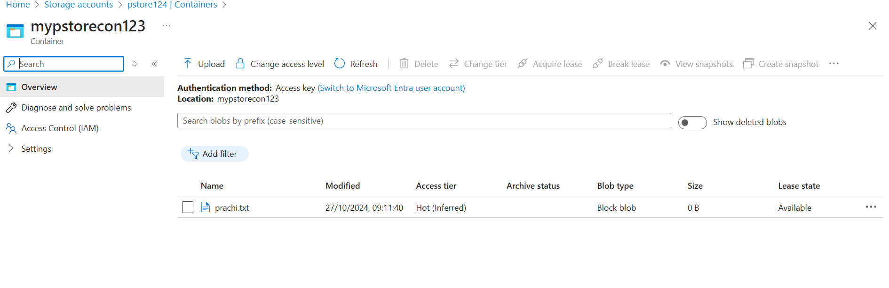
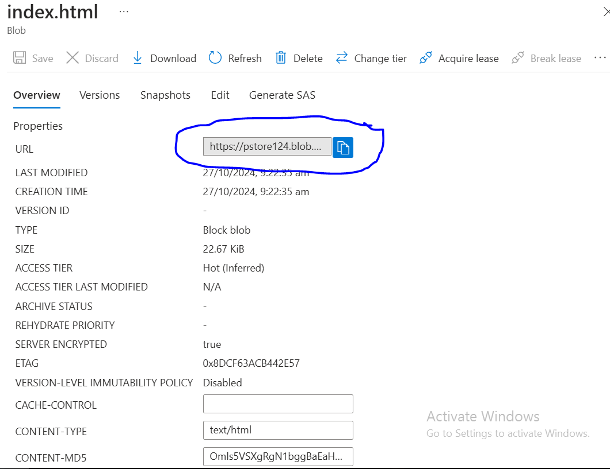
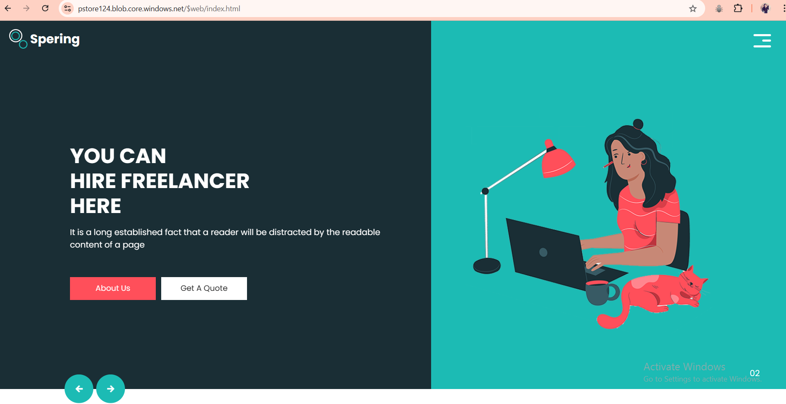

## Azure Storage Account CLI For Static Web Page

### Install Azure CLI

* For Azure CLI reference, refer [here](https://learn.microsoft.com/en-us/cli/azure/install-azure-cli).

### Login into Azure

```bash
az login
```

### create a resource group

```bash
 az group create -n prgrp -l westus
```


### create a storage container

```bash

az storage account create \
    --resource-group prgrp \
    --name pstore124 \
    --location westus \
    --allow-blob-public-access \
    --sku Standard_RAGRS
```


### create a container inside a storage account

```bash
az storage container create \
    --name mypstorecon123 \
    --account-name "pstore124" \
    --public-access "blob" \
    --resource-group prgrp
```

- Upload a Blob

```bash
az storage blob upload \
  --account-name "pstore124" \
  --container-name "mypstorecon123" \
  --file prachi.txt
```



- Upload a folder inside a new container test

```bash
    az storage blob upload-batch \
    --account-name "pstore124" \
    --source "G:\VisualStudio\Html\spering-html" \
    --destination test
```

- Upload a website to a new container called as test

```bash
az storage blob service-properties update \
--account-name "pstore124" \
--static-website \
--index-document index.html

az storage blob upload-batch \
    --account-name "pstore124" \
    --source "G:\VisualStudio\Html\spering-html" \
    --destination test
```



- copy the link and paste it into browser
  

- Delete the blob

```bash
 az storage blob delete \
    --account-name "pstore124" \
    --container-name "mypstorecon123" \
    --name "prachi.txt"
```

- Delete the container

```bash
az storage container delete \
    --name "mypstorecon123" \
    --account-name "pstore124" \
    --resource-group "prgrp"
```

- Delete the StorageAccount

```bash
az storage account delete \
    --resource-group prgrp \
    --name pstore124 \
    --location westus \
    --allow-blob-public-access \
    --sku Standard_RAGRS
```

- Delete the Respourcegroup

```bash
az group delete --name pgroup --yes
```
